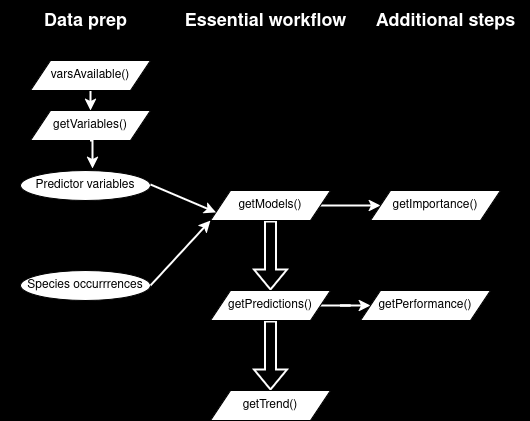

<!-- README.md is generated from README.Rmd. Please edit that file -->

```{r settings, include = FALSE}
knitr::opts_chunk$set(
  collapse = TRUE,
  comment = "#>",
  fig.path = "man/figures/README-",
  out.width = "100%",
  eval = TRUE,
  echo = TRUE,
  include = TRUE
)
```

# ecotrends (version `r packageVersion("ecotrends")`)

<!-- badges: start -->

<!-- badges: end -->

The goal of `ecotrends` is to **compute a time series of ecological niche models**, using species occurrence data and environmental variables, and then map the existence and direction of **linear temporal trends in environmental suitability**, as in [Arenas-Castro & Sillero (2021)](https://doi.org/10.1016/j.scitotenv.2021.147172).

This package is part of the [MontObEO project](https://montobeo.wordpress.com/).

Here is a very basic flow chart of the package:



## Installation

You can (re)install `ecotrends` from GitHub and then load it:

```{r install}
# devtools::install_github("AMBarbosa/ecotrends")  # run if you don't have the latest version!

library(ecotrends)
```

## Usage

You'll need some **species presence coordinates**. The code below downloads some example occurrence data from GBIF (just from a couple of years, to avoid the example taking a long time to download), and then performs just a **basic automatic cleaning**:

```{r occurrences}
library(geodata)
library(fuzzySim)

occ_raw <- geodata::sp_occurrence(genus = "Chioglossa", 
                                  species = "lusitanica",
                                  args = c("year=2022,2024"), 
                                  fixnames = FALSE)

occ_clean <- fuzzySim::cleanCoords(data = occ_raw, 
                                   coord.cols = c("decimalLongitude", "decimalLatitude"), 
                                   uncert.col = "coordinateUncertaintyInMeters",
                                   uncert.limit = 10000, 
                                   abs.col = "occurrenceStatus", 
                                   plot = FALSE)

occ_coords <- occ_clean[ , c("decimalLongitude", "decimalLatitude")]
```

You should also **delimit a region for modelling**. You can provide your own spatial extent or polygon -- e.g., a biogeographical region that is **within your species' reach**, and within which that species was **reasonably surveyed** (mind that pixels within your region that don't overlap species presences are taken by Maxent as available and unoccupied). Alternatively or additionally, you can use e.g. the code below to compute a *reasonably sized* area around your species occurrences (see help file and try out different options, some of which may be much more adequate for your particular case!):

```{r region}
reg <- fuzzySim::getRegion(pres.coords = occ_coords,
                           CRS = "EPSG:4326",  # make sure it's correct for your data!
                           type = "width",
                           width_mult = 0.5,
                           dist_mult = 1)

countries <- geodata::world(path = "outputs/countries")

plot(countries, add = TRUE)
```

Now let's **download some variables** with which to build a **yearly time series** of ecological niche models for this species in this region. You can first use the `varsAvailable` function to check which variables and years are available through the `ecotrends` package, and then the `getVariables` function to download the ones you choose (unless you want to use your own variables from elsewhere). Mind that the download may take a long time:

```{r variables}
ecotrends::varsAvailable()

vars <- ecotrends::getVariables(vars = c("tmin", "tmax", "ppt", "pet", "ws"), 
                                years = 1981:1990, 
                                region = reg, 
                                file = "outputs/variables")

names(vars)
plot(vars[[1:6]])
```

These variable raster layers have a given pixel size in geographic degrees, with a nominal pixel size *at the Equator*, but (as the longitude meridians all converge towards the poles) actual pixel sizes can vary widely across latitudes. So, let's **check the average pixel size in our study region**, as well as the spatial uncertainty values of our occurrence coordinates:

```{r pixelarea}
sqrt(ecotrends::pixelArea(vars))

summary(occ_clean$coordinateUncertaintyInMeters, na.rm = TRUE)
```

You can see there are several occurrence points with spatial uncertainty larger than our pixel size, so it might be a good idea to **coarsen the spatial resolution** of the variable layers:

```{r aggregate}
vars_agg <- terra::aggregate(vars, 
                             fact = 2)

sqrt(ecotrends::pixelArea(vars_agg))
```

This is much closer to the spatial resolution of many of the species occurrences. We can now **compute yearly ecological niche models** with these occurrences and variables, optionally saving the results to a file:

```{r models}
mods <- ecotrends::getModels(occs = occ_coords, 
                             rasts = vars_agg, 
                             region = reg,
                             nbg = 10000,
                             nreps = 3,
                             collin = TRUE, 
                             maxcor = 0.75,
                             maxvif = 5,
                             classes = "default", 
                             regmult = 1, 
                             file = "outputs/models")
```

Note that (if you have `fuzzySim` \>= 4.26 installed) you can add a `bias` layer to drive the selection of background points to incorporate survey effort, if your study area contains more pixels than `nbg`. See the `?getModels` help file for more details.

You can compute the **permutation importance** of each variable in each of the output models, as well as the mean and standard deviation across replicates for each year:

```{r varimp}
set.seed(1)  # to make next output reproducible

varimps <- getImportance(mods, nper = 10, # increase 'nper' for more robust (albeit slower) results
                         plot = TRUE, main = "Mean variable importance", las = 2)

head(varimps, 8)
```

Note that the output plot does not reflect the deviations around the mean importance of each variable each year (see this value in the output table); and that the plot may become too crowded if there are many variables or if their importances overlap. Note also that **"variable importance" is a vague concept** which can be measured in several different ways, with potentially varying results!

Let's now **compute the model predictions** for each year, optionally delimiting them to the modelled region (though you can predict on a larger or an entirely different region, assuming that the species-environment relationships are the same as in the modelled region), and optionally exporting the results to a file:

```{r predictions}
preds <- ecotrends::getPredictions(rasts = vars_agg, 
                                   mods = mods, 
                                   region = reg,
                                   type = "cloglog",
                                   clamp = TRUE,
                                   file = "outputs/predictions")

names(preds)
plot(preds[[1]], range = c(0, 1), nr = 1)
```

You can also map the mean prediction across replicates per year:

```{r mean_pred}
preds_mean <- terra::rast(lapply(preds, terra::app, "mean"))
plot(preds_mean, nr = 2)
```

You can **evaluate the fit** of these predictions to the model training data:

```{r performance}
par(mfrow = c(2, 2))

perf <- ecotrends::getPerformance(rasts = preds,
                                  mods = mods,
                                  plot = FALSE)

head(perf)
```

Note that `rasts` here can be either the output of `getPredictions()`, or a `file` argument previously provided to `getPredictions()`, in case you exported predictions in a previous R session and don't want to compute them again.

Finally, you can use the `getTrend` function to **get the slope and significance of a linear (monotonic) temporal trend in suitability** in each pixel (as long as there are enough time steps with suitability values), optionally providing your occurrence coordinates if you want the results to be restricted to the pixels that overlap them:

```{r trend}
trend <- ecotrends::getTrend(rasts = preds,
                             occs = occ_coords,
                             full = TRUE,
                             file = "outputs/trend")

plot(trend, 
     col = hcl.colors(100, "spectral"),
     type = "continuous")
```

See `?trend::sens.slope` to know more about these statistics. If you want to compute only the slope layer (with only the significant values under 'alpha'), set `full = FALSE` above. Or you can compute the full result as above, but plot just a layer you're interested in, and optionally add the region polygon:

```{r trend2}
plot(trend[["slope"]], 
     col = hcl.colors(100, "spectral"))

plot(reg, lwd = 0.5, add = TRUE)
plot(countries, lwd = 0.8, add = TRUE)
```

Positive slope values indicate increasing suitability, while negative values indicate decreasing suitability over time. Pixels with no value have no significant linear trend (or no occurrence points, if `occs` are provided).
