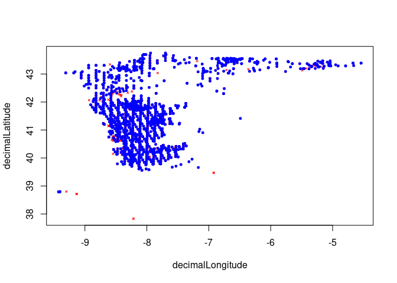

<!-- README.md is generated from README.Rmd. Please edit that file -->

# ecotrends

<!-- badges: start -->
<!-- badges: end -->

The goal of `ecotrends` is to compute a time series of ecological niche
models, using species occurrence data and environmental variables, and
then analyse the trends in environmental suitability over time.

## Installation

You can install the development version of `ecotrends` with:

``` r
# [UNDER CONSTRUCTION]
```

## Example

This is a basic example which shows you how to use this package.

You first should get some species presence coordinates. The code below
downloads some example occurrence data from GBIF and and perform **just
a basic** cleaning:

``` r
library(geodata)
#> Loading required package: terra
#> terra 1.7.71
library(fuzzySim)

occ <- geodata::sp_occurrence(genus = "Chioglossa", species = "lusitanica", fixnames = FALSE)
#> Loading required namespace: jsonlite
#> 3524 records found
#> 0-300-600-900-1200-1500-1800-2100-2400-2700-3000-3300-3524
#> 3524 records downloaded

occ <- fuzzySim::cleanCoords(occ, coord.cols = c("decimalLongitude", "decimalLatitude"), uncert.col = "coordinateUncertaintyInMeters", uncert.limit = 10000, year.col = "year", year.min = 1970, abs.col = "occurrenceStatus", plot = TRUE)
#> 3524 rows in input data
#> 1972 rows after 'rm.dup'
#> 1971 rows after 'rm.equal'
#> 1971 rows after 'rm.imposs'
#> 1971 rows after 'rm.missing.any'
#> 1971 rows after 'rm.zero.any'
#> 1971 rows after 'rm.imprec.any'
#> 1898 rows after 'rm.uncert' (with uncert.limit=10000 and uncert.na.pass=TRUE)
#> 1898 rows after 'rm.abs'
#> 1888 rows after 'year.min' (with year.min=1970 and year.na.pass=TRUE)
```


