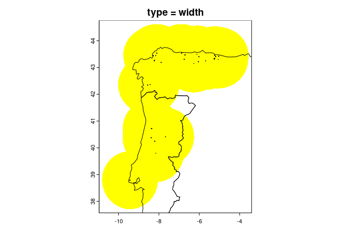
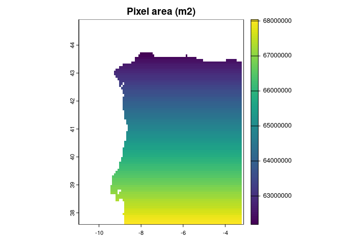
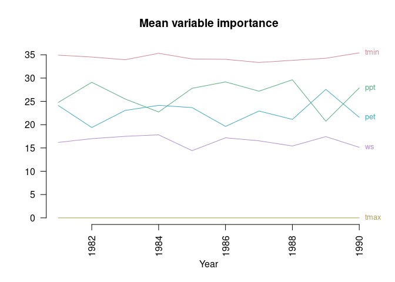
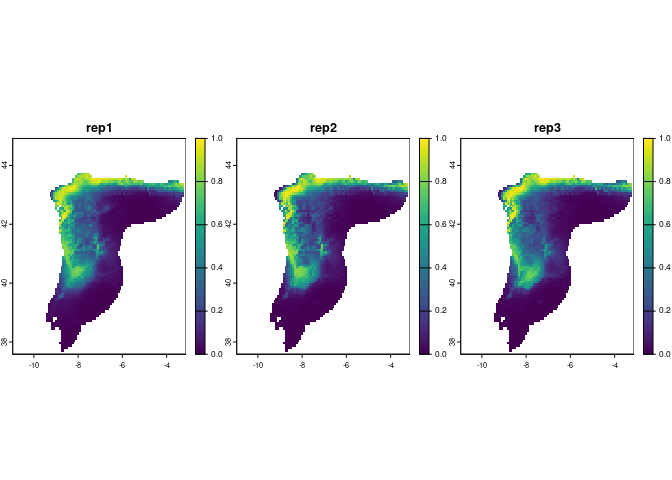
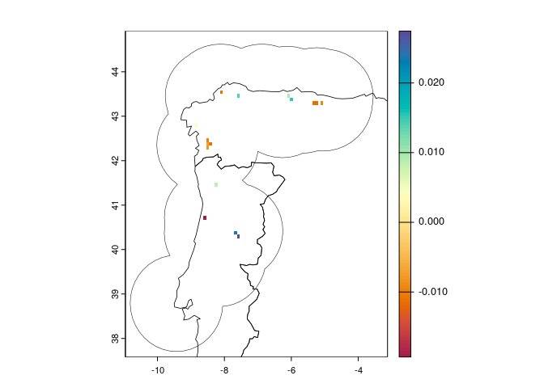

<!-- README.md is generated from README.Rmd. Please edit that file -->

# ecotrends (version 1.1)

<!-- badges: start -->

<!-- badges: end -->

The goal of `ecotrends` is to **compute a time series of ecological
niche models**, using species occurrence data and environmental
variables, and then map the existence and direction of **linear temporal
trends in environmental suitability**, as in [Arenas-Castro & Sillero
(2021)](https://doi.org/10.1016/j.scitotenv.2021.147172).

This package is part of the [MontObEO
project](https://montobeo.wordpress.com/).

Here is a very basic flow chart of the package:


## Installation

You can (re)install `ecotrends` from GitHub and then load it:

``` r
# devtools::install_github("AMBarbosa/ecotrends")  # run if you don't have the latest version!

library(ecotrends)
```

## Usage

### Species occurrences

You’ll need some **species presence coordinates**. The code below
downloads some example occurrence data from GBIF (just from a couple of
years, to avoid the example taking a long time to download), and then
performs just a **basic automatic cleaning**:

``` r
library(geodata)
#> Loading required package: terra
#> terra 1.8.54
library(fuzzySim)

occ_raw <- geodata::sp_occurrence(genus = "Chioglossa", 
                                  species = "lusitanica",
                                  args = c("year=2022,2024"), 
                                  fixnames = FALSE)
#> Loading required namespace: jsonlite
#> 509 records found
#> 0-300-509
#> 509 records downloaded

occ_clean <- fuzzySim::cleanCoords(data = occ_raw, 
                                   coord.cols = c("decimalLongitude", "decimalLatitude"), 
                                   uncert.col = "coordinateUncertaintyInMeters",
                                   uncert.limit = 10000, 
                                   abs.col = "occurrenceStatus", 
                                   plot = FALSE)
#> 509 rows in input data
#> 477 rows after 'rm.dup'
#> 477 rows after 'rm.equal'
#> 477 rows after 'rm.imposs'
#> 477 rows after 'rm.missing.any'
#> 477 rows after 'rm.zero.any'
#> 476 rows after 'rm.imprec.any'
#> 33 rows after 'rm.uncert' (with uncert.limit=10000 and uncert.na.pass=TRUE)
#> 33 rows after 'rm.abs'

occ_coords <- occ_clean[ , c("decimalLongitude", "decimalLatitude")]
```

### Spatial extent for modelling

You should also **delimit a region for modelling**. You can provide your
own spatial extent or polygon – e.g., a biogeographical region that is
**within your species’ reach**, and within which that species was
**reasonably surveyed** (mind that pixels within your region that don’t
overlap species presences are taken by Maxent as available and
unoccupied). Alternatively or additionally, you can use e.g. the code
below to compute a *reasonably sized* area around your species
occurrences (see help file and try out different options, some of which
may be much more adequate for your particular case!):

``` r
reg <- fuzzySim::getRegion(pres.coords = occ_coords,
                           CRS = "EPSG:4326",  # make sure it's correct for your data!
                           type = "width",
                           width_mult = 0.5,
                           dist_mult = 1)

countries <- geodata::world(path = "outputs/countries")

plot(countries, add = TRUE)
```



### Predictor variables

Now let’s **download some variables** with which to build a **yearly
time series** of ecological niche models for this species in this
region. You can first use the `varsAvailable` function to check which
variables and years are available through the `ecotrends` package, and
then the `getVariables` function to download the ones you choose (unless
you want to use your own variables from elsewhere). Mind that the
download may take a long time:

``` r
ecotrends::varsAvailable()
#> $TerraClimate
#> $TerraClimate$vars
#>  [1] "ws"   "vpd"  "vap"  "tmin" "tmax" "swe"  "srad" "soil" "g"    "ppt" 
#> [11] "pet"  "def"  "aet"  "PDSI"
#> 
#> $TerraClimate$years
#>  [1] 1958 1959 1960 1961 1962 1963 1964 1965 1966 1967 1968 1969 1970 1971 1972
#> [16] 1973 1974 1975 1976 1977 1978 1979 1980 1981 1982 1983 1984 1985 1986 1987
#> [31] 1988 1989 1990 1991 1992 1993 1994 1995 1996 1997 1998 1999 2000 2001 2002
#> [46] 2003 2004 2005 2006 2007 2008 2009 2010 2011 2012 2013 2014 2015 2016 2017
#> [61] 2018 2019 2020

vars <- ecotrends::getVariables(vars = c("tmin", "tmax", "ppt", "pet", "ws"), 
                                years = 1981:1990, 
                                region = reg, 
                                file = "outputs/variables")
#> Variables imported from the specified 'file', which already exists in the current working directory. Please provide a different 'file' path/name if this is not what you want.

names(vars)
#>  [1] "tmin_1981" "tmin_1982" "tmin_1983" "tmin_1984" "tmin_1985" "tmin_1986"
#>  [7] "tmin_1987" "tmin_1988" "tmin_1989" "tmin_1990" "tmax_1981" "tmax_1982"
#> [13] "tmax_1983" "tmax_1984" "tmax_1985" "tmax_1986" "tmax_1987" "tmax_1988"
#> [19] "tmax_1989" "tmax_1990" "ppt_1981"  "ppt_1982"  "ppt_1983"  "ppt_1984" 
#> [25] "ppt_1985"  "ppt_1986"  "ppt_1987"  "ppt_1988"  "ppt_1989"  "ppt_1990" 
#> [31] "pet_1981"  "pet_1982"  "pet_1983"  "pet_1984"  "pet_1985"  "pet_1986" 
#> [37] "pet_1987"  "pet_1988"  "pet_1989"  "pet_1990"  "ws_1981"   "ws_1982"  
#> [43] "ws_1983"   "ws_1984"   "ws_1985"   "ws_1986"   "ws_1987"   "ws_1988"  
#> [49] "ws_1989"   "ws_1990"
plot(vars[[1:6]])
```


### Spatial resolution for modelling

These variable raster layers have a given pixel size in geographic
degrees, with a nominal pixel size *at the Equator*, but (as the
longitude meridians all converge towards the poles) actual pixel sizes
can vary widely across latitudes. So, let’s **check the average pixel
size in our study region**, as well as the spatial uncertainty values of
our occurrence coordinates:

``` r
sqrt(ecotrends::pixelArea(vars))
```


    #> Mean pixel area (m2):
    #> 16321122.5160472
    #> [1] 4039.941

    summary(occ_clean$coordinateUncertaintyInMeters, na.rm = TRUE)
    #>    Min. 1st Qu.  Median    Mean 3rd Qu.    Max.    NA's 
    #>    1000    1000    1000    1000    1000    1000       3

You can see there are several occurrence points with spatial uncertainty
larger than our pixel size, so it might be a good idea to **coarsen the
spatial resolution** of the variable layers:

``` r
vars_agg <- terra::aggregate(vars, 
                             fact = 2)

sqrt(ecotrends::pixelArea(vars_agg))
```



    #> Mean pixel area (m2):
    #> 65290574.0163304
    #> [1] 8080.258

This is much closer to the spatial resolution of many of the species
occurrences.

### Model building

We can now **compute yearly ecological niche models** with these
occurrences and variables, optionally saving the results to a file:

``` r
mods <- ecotrends::getModels(occs = occ_coords, 
                             rasts = vars_agg, 
                             region = reg,
                             nbg = 10000,
                             nreps = 3, # increase 'nreps' for more robust (albeit slower) results
                             collin = TRUE, 
                             maxcor = 0.75,
                             maxvif = 5,
                             classes = "default", 
                             regmult = 1, 
                             file = "outputs/models")
#> Models imported from the specified 'file', which already exists in the current working directory. Please provide a different 'file' path/name if this is not what you want.
```

Note that (if you have `fuzzySim` \>= 4.26 installed) you can add a
`bias` layer to drive the selection of background points to incorporate
survey effort, if your study area contains more pixels than `nbg`. See
the `?getModels` help file for more details.

### Variable importance

You can compute the **permutation importance** of each variable in each
of the output models, as well as the mean and standard deviation across
replicates for each year:

``` r
set.seed(1)  # to make next output reproducible

varimps <- ecotrends::getImportance(mods, 
                                    nper = 10, # increase 'nper' for more robust (albeit slower) results
                                    plot = TRUE, 
                                    main = "Mean variable importance", 
                                    ylab = "", 
                                    las = 2)
#> computing period 1 of 10 (with replicates): 1981
#> computing period 2 of 10 (with replicates): 1982
#> computing period 3 of 10 (with replicates): 1983
#> computing period 4 of 10 (with replicates): 1984
#> computing period 5 of 10 (with replicates): 1985
#> computing period 6 of 10 (with replicates): 1986
#> computing period 7 of 10 (with replicates): 1987
#> computing period 8 of 10 (with replicates): 1988
#> computing period 9 of 10 (with replicates): 1989
#> computing period 10 of 10 (with replicates): 1990
```



``` r

head(varimps, 8)
#>   period  variable     rep1     rep2     rep3     mean        sd
#> 1   1981 tmin_1981 34.08416 37.20650 33.44227 34.91098 1.6441948
#> 2   1981 tmax_1981  0.00000  0.00000  0.00000  0.00000 0.0000000
#> 3   1981  ppt_1981 26.97670 20.82831 26.52798 24.77766 2.7986177
#> 4   1981  pet_1981 24.07393 26.34771 21.92923 24.11695 1.8040937
#> 5   1981   ws_1981 14.86521 15.61749 18.10053 16.19441 1.3823769
#> 6   1982 tmin_1982 34.25688 33.98315 35.31589 34.51864 0.5747116
#> 7   1982 tmax_1982  0.00000  0.00000  0.00000  0.00000 0.0000000
#> 8   1982  ppt_1982 27.68860 30.90411 28.70352 29.09874 1.3421438
```

Note that the output plot does not reflect the deviations around the
mean importance of each variable each year (see this value in the output
table); and that the plot may become too crowded if there are many
variables or if their importances overlap. Note also that **“variable
importance” is a vague concept** which can be measured in several
different ways, with potentially varying results!

### Model predictions

Let’s now **compute the model predictions** for each year, optionally
delimiting them to the modelled region (though you can predict on a
larger or an entirely different region, assuming that the
species-environment relationships are the same as in the modelled
region), and optionally exporting the results to a file:

``` r
preds <- ecotrends::getPredictions(rasts = vars_agg, 
                                   mods = mods, 
                                   region = reg,
                                   type = "cloglog",
                                   clamp = TRUE,
                                   file = "outputs/predictions")
#> Predictions imported from the specified 'file', which already exists in the current working directory. Please provide a different 'file' path/name if this is not what you want.

names(preds)
#>  [1] "1981" "1982" "1983" "1984" "1985" "1986" "1987" "1988" "1989" "1990"
plot(preds[[1]], range = c(0, 1), nr = 1)
```



You can also map the mean prediction across replicates per year:

``` r
preds_mean <- terra::rast(lapply(preds, terra::app, "mean"))
plot(preds_mean, nr = 2)
```


### Model evaluation

You can **evaluate the fit** of these predictions to the model training
data:

``` r
par(mfrow = c(2, 2))

perf <- ecotrends::getPerformance(rasts = preds,
                                  mods = mods,
                                  plot = FALSE)
#> evaluating period 1 of 10 (with replicates): 1981
#> evaluating period 2 of 10 (with replicates): 1982
#> evaluating period 3 of 10 (with replicates): 1983
#> evaluating period 4 of 10 (with replicates): 1984
#> evaluating period 5 of 10 (with replicates): 1985
#> evaluating period 6 of 10 (with replicates): 1986
#> evaluating period 7 of 10 (with replicates): 1987
#> evaluating period 8 of 10 (with replicates): 1988
#> evaluating period 9 of 10 (with replicates): 1989
#> evaluating period 10 of 10 (with replicates): 1990

head(perf)
#>   period rep train_presences test_presences train_AUC  test_AUC train_TSS
#> 1   1981   1             110             28 0.8740956 0.8518081 0.6558619
#> 2   1981   2             110             28 0.8672644 0.8878075 0.6124322
#> 3   1981   3             110             28 0.8729622 0.8618532 0.6273246
#> 4   1982   1             110             28 0.8819149 0.8482923 0.6715075
#> 5   1982   2             110             28 0.8690163 0.8959793 0.6228879
#> 6   1982   3             110             28 0.8777651 0.8681924 0.6317854
#>   train_thresh_TSS  test_TSS test_thresh_TSS train_kappa train_thresh_kappa
#> 1             0.38 0.5808085            0.34   0.2139232               0.67
#> 2             0.41 0.7145572            0.34   0.2245709               0.64
#> 3             0.29 0.6625129            0.36   0.2201877               0.66
#> 4             0.41 0.5477819            0.43   0.2358166               0.71
#> 5             0.40 0.7404165            0.49   0.2153542               0.64
#> 6             0.47 0.6586985            0.35   0.2369446               0.82
#>   test_kappa test_thresh_kappa
#> 1 0.10641284              0.89
#> 2 0.16274823              0.99
#> 3 0.10803384              0.93
#> 4 0.11225416              0.84
#> 5 0.11627452              0.92
#> 6 0.07821233              0.89
```

Note that `rasts` here can be either the output of `getPredictions()`,
or a `file` argument previously provided to `getPredictions()`, in case
you exported predictions in a previous R session and don’t want to
compute them again.

### Suitability trend

Finally, you can use the `getTrend` function to **get the slope and
significance of a linear (monotonic) temporal trend in suitability** in
each pixel (as long as there are enough time steps with suitability
values), optionally providing your occurrence coordinates if you want
the results to be restricted to the pixels that overlap them:

``` r
trend <- ecotrends::getTrend(rasts = preds,
                             occs = occ_coords,
                             full = TRUE,
                             file = "outputs/trend")
#> Trend raster(s) imported from the specified 'file', which already exists in the current working directory. Please provide a different 'file' path/name if this is not what you want.

plot(trend, 
     col = hcl.colors(100, "spectral"),
     type = "continuous")
```


See `?trend::sens.slope` to know more about these statistics. If you
want to compute only the slope layer (with only the significant values
under ‘alpha’), set `full = FALSE` above. Or you can compute the full
result as above, but plot just a layer you’re interested in, and
optionally add the region polygon:

``` r
plot(trend[["slope"]], 
     col = hcl.colors(100, "spectral"))

plot(reg, lwd = 0.5, add = TRUE)
plot(countries, lwd = 0.8, add = TRUE)
```



Positive slope values indicate increasing suitability, while negative
values indicate decreasing suitability over time. Pixels with no value
have no significant linear trend (or no occurrence points, if `occs` are
provided).
